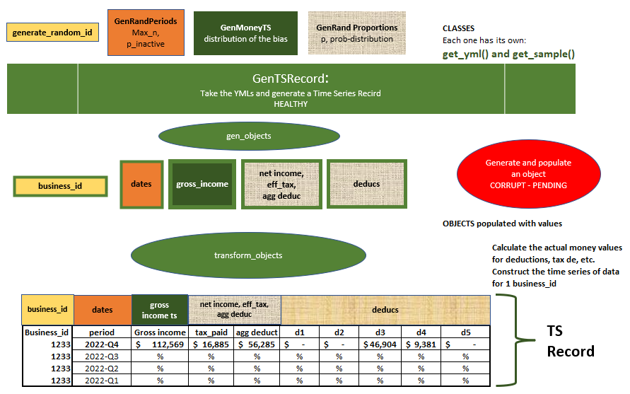
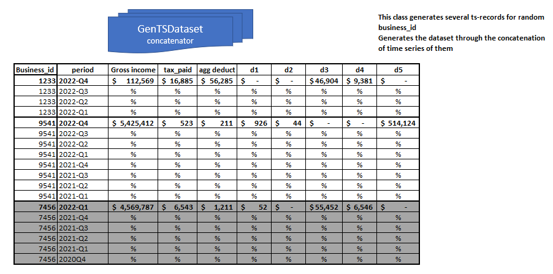
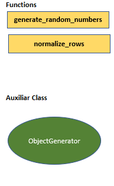

# Time Series Data Generation

## What is this?
    This is a set of resources to generate time series random records in a scalable way. 
    
## Purpose
    Initialy, the purpose is to be able to generate non-compliance data for corporate taxes. However, it can be generalized and extent to any kind of time series data.
    
## How it works
    Out of the box, you can create time series of no-compliance data using:
    
    `$python ts_dataset_generator.py --n_samples=40 --export_csv --debug`

    In case you want a diferent set of columns, you should adapt mainly two functions of the `GenTSRecord` class:
    1) `gen_objects` function change: Choose from the available classes to include in your records, and adapt the `gen_objects` function. This function uses the `ObjectGenerator` class, for instantiating and populating the desire raw objects.
    2) `transform_object` function :Adapt the `transform_object` class to do any changes in the raw objects (multiply columns, drop columns, etc.).
    
    To generate a dataset, you use the calss `GenTSDataset`, which will generate a concatenate `n` random records with the specifications in the yml files and the `GenTSRecord`.
    
    Once all is working, you run the file `ts_dataset_generator.py` in the terminal.
    
## Available Classes
    The file `ts_dataset_generator.py` include the following classes that can be selected to construct and populate time series objects:
    1) GenRandProportions
    2) GenPeriods
    3) GenMoneyTS
    4) GenRandPeriods

    Also there is a function to generate ids:
    `generate_random_id`
    
    Each class have a get_yml() method to get the parameters to populate the object.
    
    Here is a diagram of how the process works:
    

Some additional functions, and clases:

# Addition of new classes
    To add a new class that is in sync with the pholosophy of this objects, it is required that any new class has defined the following methods:
    1) `get_yml()`: method that allow to read a ymal file with the parameters. The ymal file must have a header to recognize the object once is read it.
    2) `get_sample()`: method that populates the object based on the parameters of the ymal file.

# Authors
Initial version designed by Paola Carvajal for the analytics team.
    
